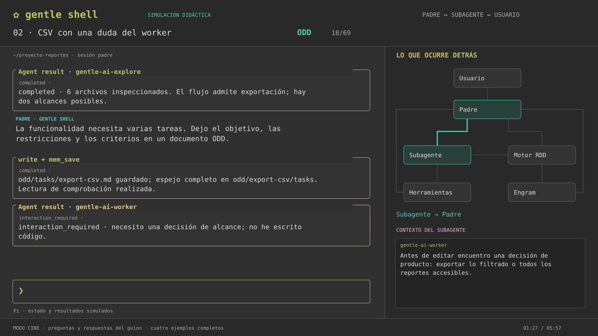

# Gentle: una sesión por dentro

Simulación animada de Gentle Shell, Gentle AI y Pi: desde el mensaje en la barra de entrada hasta la respuesta final, con ODD, TDD y RDD. Interfaz inspirada en la referencia de terminal del usuario.



- **[Video completo · 5:57](Gentle_Sesion_Completa.mp4)**: cuatro ejemplos con escritura animada, conversación, tarjetas de resultados y traspasos de contexto en SVG. Sin audio; explicaciones en pantalla.
- **[Simulador interactivo](Simulador_Gentle.html)**: descargar y abrir en el navegador. Funciona sin servidor ni conexión. Reproducción, pausa, velocidad, pasos, tarjetas desplegables y «Decidir yo».
- **[Guía de contratos y fuentes oficiales](docs/Guia_Gentle_ODD_TDD_RDD.md)**: reglas, excepciones y discrepancias entre documentación y código.

## Los cuatro ejemplos

| Caso | Qué muestra |
|---|---|
| Cambio pequeño de texto | ODD proporcional, edición acotada y verificación |
| Exportación CSV | Exploración, documento ODD y espejo Engram, delegación, duda del worker → padre → usuario → worker, TDD y revisión |
| Autorización de acceso | Riesgo alto, RDD, refutación, corrección acotada, validación dirigida y ACK |
| Retomar una tarea | Memoria no disponible, recuperación desde documento, relanzamiento y verificación alternativa |

El video recorre las respuestas predeterminadas. En el HTML se puede elegir el alcance de la exportación o declinar la revisión. Los mensajes y salidas son ilustrativos: no hay un modelo, memoria ni herramientas conectadas. Se muestran acciones observables y contratos; no razonamiento privado. Los diálogos de consentimiento están simplificados para enseñar el flujo.

## Código editable

- `simulador/create_scenarios.py`: guion y alternativas; genera `scenarios.json`.
- `simulador/engine.js`: estados, decisiones, tiempo e historial separado padre/hijo.
- `simulador/app.js` y `style.css`: terminal y conexiones SVG animadas.
- `simulador/build.py`: genera el HTML autónomo.
- `simulador/render_session.py`: genera escenas SVG, rasteriza y exporta el MP4 con escritura y partículas animadas.
- `simulador/timeline.json`: tiempos de los 69 pasos del video.

## Regenerar

Requiere Python 3, Node.js y FFmpeg disponibles en PATH. El render de video utiliza DejaVu Sans Mono en Linux (`/usr/share/fonts/truetype/dejavu/DejaVuSansMono.ttf`).

```bash
npm install
python -m pip install -r requirements.txt
python simulador/create_scenarios.py
python simulador/build.py
node simulador/engine.test.cjs
python simulador/render_session.py
```

Para exportar solo los diagramas SVG de cada paso: `python simulador/render_session.py --svg-only`. Para incluir PNG: `--frames-only`. Se guardan en `session-frames/`, excluido de Git por ser regenerable.

Validación realizada: pruebas del motor para decisiones bloqueantes, alternativas, separación padre/hijo, espera de `agent_settled` y cierre de los cuatro casos; inspección visual de escenas SVG rasterizadas y comprobación técnica del MP4. La interfaz HTML no se probó en un navegador real en este entorno.

## Referencias

Los enlaces dentro del simulador y la guía fijan las revisiones oficiales consultadas: Gentle AI `f0782af` y Gentle Shell `5454832`. Los diagramas originales ODD, RDD y orquestación guiaron los contratos del guion. No se presentan como una grabación literal de la aplicación.

`Gentle_Flujo_Animado.html`, `Gentle_Flujo_Animado.svg` y `fuentes/` conservan la explicación anterior por diagramas como material complementario. La entrega principal es la simulación de sesión de arriba.
