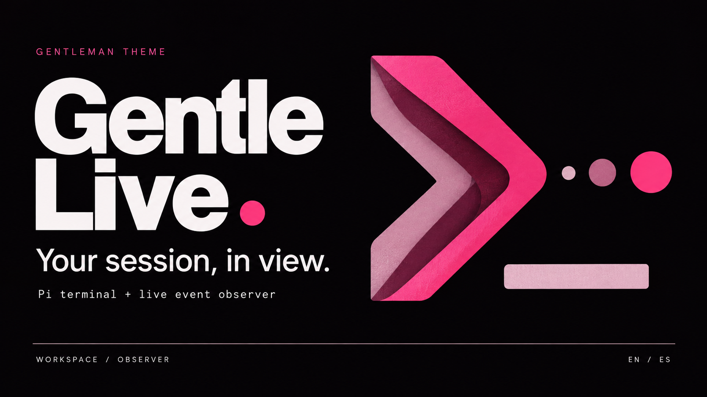

# Gentle · Behind the session



*Brand illustration in the Gentleman palette; not a runtime screenshot.*

See the conversation and the observable handoffs behind Gentle AI, Gentle Shell and Pi. Switch EN/ES locally without extra model calls.

## Two live modes, English and Spanish

- **[Open the English demo](Gentle_Live_Demo.html)** — download and open in your browser. Four examples, an animated SVG graph, playback controls, inspectable events and a user decision that returns through the parent.
- **[Install the Live observer](live/README.md)** — connect the same interface to events from your real Pi session with Gentle Shell. User input, delegations, tool progress, questions, results and runtime settlement appear as they happen.

```sh
pi install git:github.com/Maicololiveras/flugo-gentle@v1.0.0
```

Restart or reload Pi, run `/gentle-live`, and open the complete loopback URL printed in the terminal. Send tasks and answer questions in the terminal. Stop with `/gentle-live stop`. For local development from a clone, use `pi install ./live` instead.

| Example | What it explains |
|---|---|
| A small change | Proportional ODD and a bounded documentation edit |
| CSV export | Exploration, intent, memory, delegation, worker → parent → user decision, configured TDD and review |
| Authorization fix | High-risk RDD, four perspectives, refutation, scoped repair, directed validation and ACK |
| Resume work | Memory unavailable, document recovery, relaunch and configured checks without claiming TDD |

Demo and Live are visibly distinct. Live shows evidence the runtime exposes; it does not fabricate private child activity, infer a review verdict, or expose private reasoning. The extension is passive and does not replace Gentle's execution or approval flow.

### Workspace: Pi terminal and graph together

```sh
npm --prefix live install
node live/workspace.mjs --cwd /absolute/path/to/project
```

Open the local URL and click **Start Pi**. Work in the embedded terminal while the graph follows observable events. Linux and macOS are the target platforms. Use `/gentle-live` for read-only observation of an existing terminal session. See [two modes, platforms and token cost](integrations/gentle-ai/TWO_MODES.md).

The viewer adds no model calls. Pi/Gentle tasks retain their normal token usage; native responses remain in their original language.

## Passive benchmarks (feature branch)

Open **Benchmarks** for live request-hook counts, tool lifecycles, human interactions, SDK token/cost coverage, cache reads/writes, local history and explicit baseline comparison. The recorder makes **no additional LLM calls**. Optional Gentle child metrics are shown separately when exposed. Missing data stays unavailable; the UI does not manufacture savings.

See [measurement definitions, caching formulas, historical import and the A/B protocol](live/BENCHMARKS.md). Use `feature/passive-benchmarks` to try this version; it is not merged into `main` or included in the `v1.0.0` tag.

## Gentle AI repository integration

See [plugin staging](integrations/gentle-ai/README.md) and the [local-agent handoff](integrations/gentle-ai/LOCAL_AGENT_HANDOFF.md). The handoff includes remaining installer work, automated visual tests, real-session cases and acceptance evidence.

## Development

```sh
node live/build.mjs
node --test live/tests/*.test.mjs
node simulador/engine.test.cjs
node live/demo.mjs
```

The `live/` directory is a self-contained Pi extension package with no runtime dependencies beyond Node and Pi. Its `web/` assets also produce the standalone demo.

## Documentation and archived media

All maintained repository documentation is English:

- [Complete installation, security, and operation guide](live/README.md)
- [ODD, TDD, RDD, and SDD workflow guide](docs/GENTLE_ODD_TDD_RDD_GUIDE.md)
- [Legacy simulator documentation](docs/LEGACY_SIMULATOR.md)
- [Legacy animation regeneration](docs/REGENERATION.md)
- [Integration and acceptance evidence](integrations/gentle-ai/README.md)

The archived interactive simulator and rendered videos retain Spanish on-screen copy; their English documentation labels that limitation explicitly. The maintained Live Observer UI supports English and Spanish locally.
