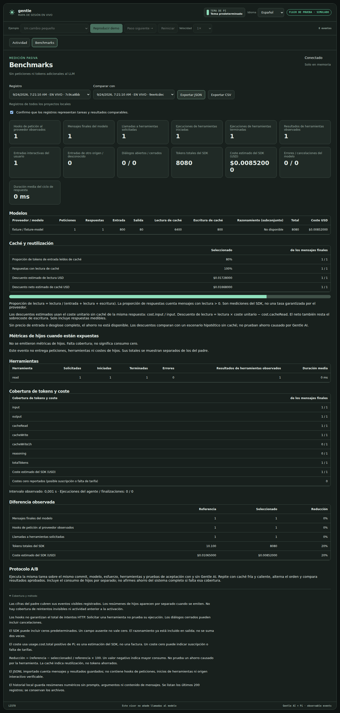
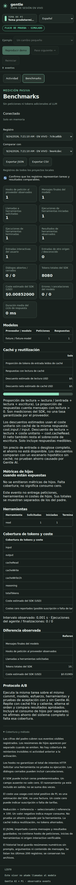

# Benchmark implementation validation — 2026-09-24

Base: main `2e1c2e05b739d56f53ce32125614d980337aecb2`.

- Node 24.19.0, Linux: 22 automated tests passed, including existing Observer/Workspace/staging checks and new accounting, cache, negative-discount, deduplication, child coverage, persistence, restart, import and authenticated endpoint tests.
- Existing Spanish simulator engine tests passed.
- Chromium 153.0.8010.0, Playwright: browser checks passed at 1440 × 1000 and 390 × 844. Offline standalone HTML, EN/ES, tab switching, baseline acknowledgement, JSON export, keyboard navigation, reconnect without duplication, no page overflow at mobile width, no page errors and no external browser requests.
- HTML standalone demo regenerated from maintained assets. `git diff --check` passed.
- All accounting fixtures are synthetic. **No real task was submitted to a model.** The 20% comparison shown in the screenshots is constructed test data that validates the formula; it is not measured Gentle AI savings.
- End-to-end provider billing, real subagent emission under a user's policy, Windows/macOS execution and real A/B trials remain to be validated with actual runtime sessions. SDK costs are estimates.

[Browser assertions](assets/benchmarks/browser-qa.json) · [A/B experiment template](BENCHMARK_EXPERIMENT_TEMPLATE.md) · [Definitions and limitations](../live/BENCHMARKS.md)

## Desktop — synthetic fixture, Spanish

## Mobile — synthetic fixture, Spanish

