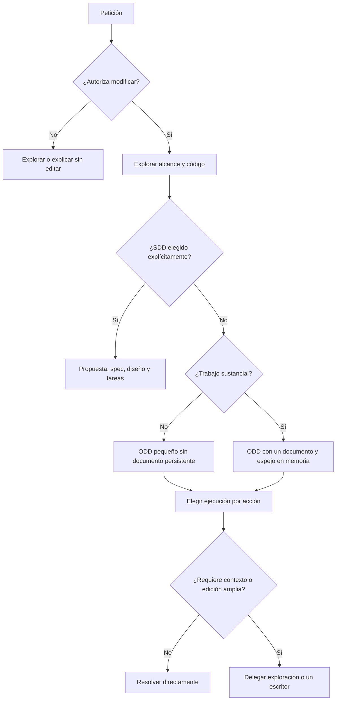
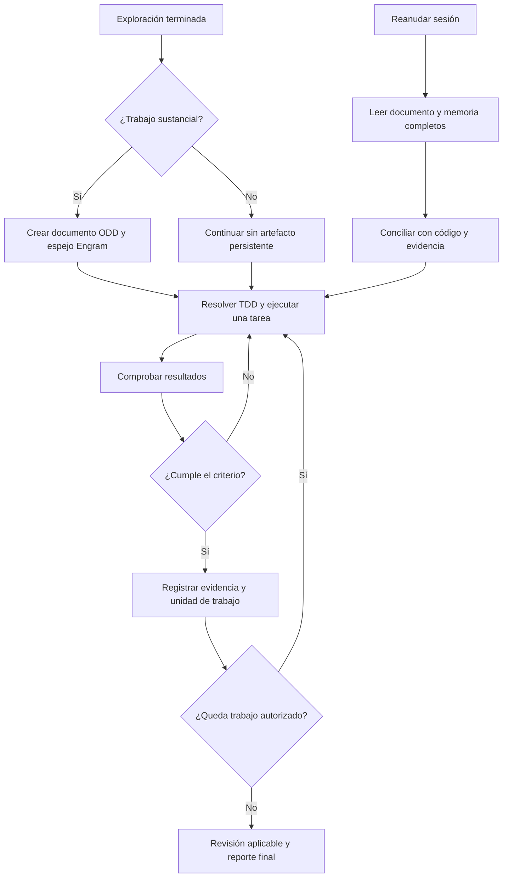
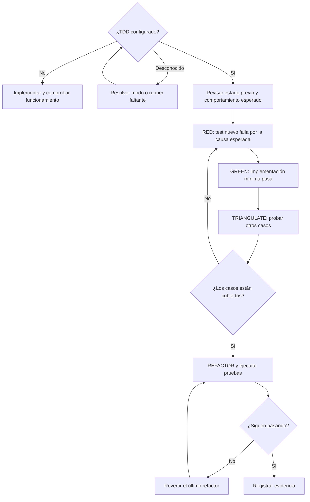
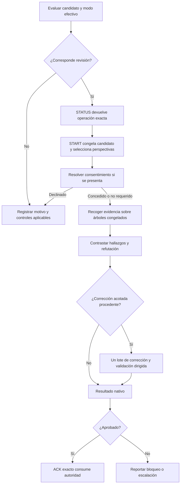
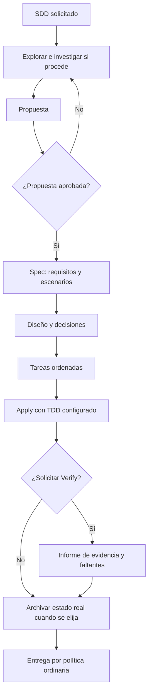

# Cómo funcionan los flujos de Gentle AI y Gentle Shell

Revisión: 20 de septiembre de 2026. Alcance: las ramas `main` descargadas, no una instalación del usuario ni una certificación de la versión estable.

- gentle-ai: `f0782af2803a8192477c18d2186795e9c9daa6c3`.
- gentle-shell: `54548321be8c8d60891e89ea13bf2b0ed10e1ac5`.

Se contrastaron documentación, instrucciones del orquestador y workers, implementación del clasificador y modo RDD, y pruebas existentes. No se ejecutaron las pruebas Go: el entorno no tiene Go disponible. No se ejecutó una sesión real de Pi. Por tanto, se verifica qué especifican e implementan las fuentes revisadas; no se demuestra cumplimiento autónomo de todos los pasos.

## 1. Primero: qué es cada pieza

| Pieza | Responsabilidad |
|---|---|
| Pi | Runtime del agente: conversación, modelos, herramientas y ejecución. |
| gentle-ai | Configura agentes y proyecta skills e instrucciones. Su binario Go gobierna las transiciones nativas de SDD y RDD. |
| gentle-shell | Entorno de trabajo para Pi: orquestador, workers, vistas de cambios, perfiles y transporte de revisión. |
| gentle-pi | Nombre que conserva el paquete npm durante la transición a gentle-shell. No son dos motores metodológicos que debas encadenar. |
| Engram | Memoria persistente separada. En ODD conserva una copia completa del documento de la funcionalidad. |

ODD organiza el trabajo diario; TDD determina cómo se construye y demuestra cada comportamiento cuando está activado; RDD revisa un candidato concreto con evidencia vinculada a él. SDD añade artefactos y fases formales solo cuando el usuario lo elige. TDD se puede usar tanto en ODD como en SDD. SDD no inicia ni consume RDD automáticamente.

Fuentes: [README de Gentle Shell](https://github.com/Gentleman-Programming/gentle-shell/blob/54548321be8c8d60891e89ea13bf2b0ed10e1ac5/README.md), [uso de Gentle AI](https://github.com/Gentleman-Programming/gentle-ai/blob/f0782af2803a8192477c18d2186795e9c9daa6c3/docs/usage.md), [contrato nativo RDD](https://github.com/Gentleman-Programming/gentle-ai/blob/f0782af2803a8192477c18d2186795e9c9daa6c3/docs/review-integration.md).

## 2. Cómo deciden el recorrido según la tarea



Hay tres escalas independientes:

| Decisión | Señal | Consecuencia |
|---|---|---|
| Persistir progreso | Dos o más pasos significativos, o progreso que merece poder recuperarse | Crear `odd/tasks/<feature-name>.md` antes de escribir código. |
| Delegar | Leer 4+ archivos para entender; investigación amplia; lectura que prepara escritura; modificar 2+ archivos no triviales | Usar un worker acotado; mantener un escritor responsable. |
| Revisar con más profundidad | Evidencia de riesgo en el candidato congelado | RDD selecciona 0, 1 o 4 perspectivas. |

Leer 1–3 archivos para decidir o verificar puede quedarse en el padre. Una edición mecánica de un archivo ya comprendido también. Las cifras describen contexto por acción, no un puntaje universal de complejidad.

Una funcionalidad grande puede seguir enteramente en ODD. Una edición de cinco líneas puede necesitar revisión profunda si altera autorización. La incertidumbre se resuelve con investigación o una pregunta concreta; no obliga a adoptar SDD.

Fuente: [reglas de enrutamiento](https://github.com/Gentleman-Programming/gentle-ai/blob/f0782af2803a8192477c18d2186795e9c9daa6c3/docs/trigger-rules.md), [delegación de Pi](https://github.com/Gentleman-Programming/gentle-shell/blob/54548321be8c8d60891e89ea13bf2b0ed10e1ac5/assets/orchestrator-delegation.md).

## 3. ODD: fase por fase

ODD significa **Organic Driven Development**. Es una guía de trabajo adaptable; sus pasos no equivalen a una nueva máquina de estados nativa obligatoria.

| Paso | Qué hace | Qué debe existir para avanzar |
|---|---|---|
| Autorizar | Distingue explicación, investigación y modificación | Alcance permitido; investigar no autoriza editar. |
| Explorar | Inspecciona código, convenciones, restricciones y pruebas pertinentes | Entendimiento suficiente del próximo cambio. |
| Resolver incertidumbre | Investiga un punto concreto o pregunta por una decisión real | Decisión o supuesto explícito que permite continuar. |
| Clasificar y registrar | Determina si conviene recuperar progreso | En trabajo sustancial, documento ODD y espejo en Engram antes del primer cambio de fuente. |
| Implementar | Ejecuta la siguiente unidad autorizada; delega cuando aporta contexto | Modo TDD, procedencia de esa elección y comando exacto de prueba. |
| Comprobar | Ejecuta verificaciones proporcionales | Resultados observados; no basta la afirmación del worker. |
| Registrar y cerrar | Actualiza tareas, evidencia, commit y siguiente paso | Pendientes y fallos declarados; revisión/entrega según política y autorización. |

El documento reúne objetivo, problema, motivo, alcance, restricciones, tareas con identificadores estables y criterios de aceptación, evidencia y siguiente paso. No hace falta fabricar proposal/spec/design para cada cambio.



Si cambian requisitos aceptados, actualiza intención y tareas afectadas, conserva trabajo válido y explica qué reabre. Si Engram falla, conserva progreso local y declara pendiente el espejo. Las dos escrituras no son atómicas: sus instrucciones piden comprobar ambas. Un hallazgo no autoriza ampliar automáticamente el producto.

**Novedad de entrega:** las instrucciones actuales organizan tareas en commits de unidades coherentes, con pruebas y documentación del comportamiento, y mensajes Conventional Commit. Esto sigue sujeto a la política del repositorio y a la autorización de entrega; un resultado RDD no la reemplaza.

Fuente: [protocolo ODD completo](https://github.com/Gentleman-Programming/gentle-ai/blob/f0782af2803a8192477c18d2186795e9c9daa6c3/docs/usage.md).

## 4. TDD: qué pasa antes de escribir implementación

TDD significa **Test-Driven Development**. La presencia de una carpeta de tests no lo activa según las instrucciones ODD actuales. El padre debe resolver modo, fuente y runner antes de delegar, y volver a resolverlos al reanudar.



| Etapa | Evidencia útil | Condición de avance |
|---|---|---|
| Estado previo | Pruebas existentes relevantes y fallos ya conocidos | Distinguir regresiones nuevas de fallos previos. |
| RED | Test del comportamiento faltante y fallo observado | Falla por la causa esperada, antes de implementar. |
| GREEN | Comando exacto y resultado correcto | La implementación real satisface el caso. |
| TRIANGULATE | Casos alternativos, negativos o límites | Evitar soluciones que solo satisfacen un ejemplo. |
| REFACTOR | Mismas pruebas después de mejorar código | Mantener comportamiento. |

Ejemplo didáctico: para un cálculo de descuento, primero una prueba espera 90 para precio 100 y descuento 10 %. La implementación mínima la satisface. Otro caso usa 200 y 15 %, esperando 170, y un caso valida entradas inválidas. Después se mejora el diseño conservando pruebas verdes. Los valores son ilustrativos, no una regla de Gentle.

En cambios sin comportamiento ejecutable, como texto documental, el worker permite justificar una excepción precisa, conservando las comprobaciones aplicables. TDD apagado significa pruebas funcionales ordinarias; no significa ausencia de controles.

**Contradicciones verificadas:** el worker ODD exige RED observado; `assets/support/strict-tdd.md` conserva una cláusula que permite inferir el fallo si la función aún no existe, sin ejecutarlo. Además, `skills/gentle-ai/SKILL.md` todavía vincula TDD a que existan tests, mientras el worker y el orquestador lo niegan. No hay base para afirmar que todas las rutas aplican exactamente el mismo protocolo. El diagrama refleja el contrato ODD explícito del worker.

Fuentes: [worker ODD](https://github.com/Gentleman-Programming/gentle-shell/blob/54548321be8c8d60891e89ea13bf2b0ed10e1ac5/assets/agents/gentle-ai-worker.md), [módulo estricto](https://github.com/Gentleman-Programming/gentle-shell/blob/54548321be8c8d60891e89ea13bf2b0ed10e1ac5/assets/support/strict-tdd.md), [skill general contradictoria](https://github.com/Gentleman-Programming/gentle-shell/blob/54548321be8c8d60891e89ea13bf2b0ed10e1ac5/skills/gentle-ai/SKILL.md).

## 5. RDD: profundidad proporcional sobre una versión exacta

RDD significa **Receipt-Driven Development**. Congela el cambio antes de revisarlo para que los revisores inspeccionen la misma versión. El código Go determina riesgo, perspectivas y transiciones; el host de Pi ejecuta los roles y devuelve resultados vinculados al candidato. El modelo no debe inventar el siguiente paso ni reconstruir sus identificadores.

### Clasificación actual

| Riesgo publicado | Evidencia | Perspectivas cuando se inicia revisión |
|---|---|---|
| `passive` | Todos los cambios demostrablemente pasivos por contenido congelado y modos | 0: lectura estructural. |
| `medium` | Cambio activo sin señales que lo eleven | 1 perspectiva seleccionada. |
| `high` | Señal sensible o ruta crítica reconocida | 4: Risk, Resilience, Readability y Reliability. |

Risk trata riesgos; Resilience, comportamiento ante fallos; Readability, claridad y mantenibilidad; Reliability, corrección y consistencia. El alcance concreto lo dan los prompts de cada rol.

Las señales incluyen autorización, seguridad, pagos, exposición/pérdida de datos, permisos y fronteras de procesos. El clasificador combina rutas, contenido y modos: no basta decir que un archivo es `.md` para declararlo pasivo. Cambiar un contrato operativo de agentes puede afectar ejecución.

### Cuándo se solicita revisión en el flujo ODD por unidades

Tras un commit de unidad de trabajo, el orquestador consulta `review assess` sobre el tramo desde la última frontera revisada. Lee `review_due` del resultado nativo:

| Caso | Resultado |
|---|---|
| Candidato exacto ya consumido | `already_reviewed`: no repetir automáticamente. |
| Alto riesgo | `high_risk`: corresponde revisión. |
| Medio con 400 o más líneas cambiadas en el tramo | `slice_budget_reached`: corresponde revisión. |
| Medio por debajo | `under_budget`: acumular en el tramo pendiente. |
| Pasivo | `passive`: controles estructurales; puede avanzar la frontera. |

Esto no permite omitir controles de entrega existentes. Un cambio medio bajo presupuesto queda pendiente; no debe declararse revisado.

**Las 400 líneas tienen tres usos diferentes:** tamaño orientativo de tareas, presupuesto del tramo para revisión media, y estrategia de división de PR. No son una regla para elevar riesgo ni un permiso para partir comportamientos artificialmente. La entrega contempla `ask-on-risk`, `auto-chain`, `single-pr` y `exception-ok`; las cadenas pueden ser `stacked-to-main` o `feature-branch-chain`.

Fuentes: [clasificador y selección 0/1/4](https://github.com/Gentleman-Programming/gentle-ai/blob/f0782af2803a8192477c18d2186795e9c9daa6c3/internal/reviewtransaction/risk.go), [cálculo de review_due](https://github.com/Gentleman-Programming/gentle-ai/blob/f0782af2803a8192477c18d2186795e9c9daa6c3/internal/cli/review_assess.go), [uso ODD](https://github.com/Gentleman-Programming/gentle-ai/blob/f0782af2803a8192477c18d2186795e9c9daa6c3/docs/usage.md).

### Transacción de revisión



Fases y límites:

1. **Evaluación y STATUS:** no equivale a aprobación. Devuelve la siguiente operación admitida.
2. **START:** vincula repositorio, candidato, revisión y linaje; selecciona perspectivas.
3. **Consentimiento:** el host respeta las opciones nativas. Rechazar este candidato no es apagar RDD globalmente.
4. **Revisores:** inspeccionan árboles inmutables, no el worktree cambiante. Devuelven hallazgos y evidencia estructurada.
5. **Refutación:** contrasta las afirmaciones para no convertir sospechas en defectos aceptados automáticamente.
6. **Corrección:** como máximo un lote acotado dentro de esa transacción; no una sucesión interminable de arreglar y revisar todo.
7. **Validación dirigida:** comprueba criterios originales y posibles regresiones de la corrección. No poder inspeccionar no equivale a aprobar ni a demostrar un defecto.
8. **Cierre:** si aprueba, la operación ACK nativa consume esa autoridad. No queda un recibo reutilizable para autorizar otros cambios. Bloqueos o escalaciones siguen sus propias continuaciones.

El resultado es informativo para entrega: no hace commit, push, PR o release ni autoriza esas operaciones. Que una revisión apruebe tampoco demuestra ausencia universal de defectos.

Fuente: [contrato de integración](https://github.com/Gentleman-Programming/gentle-ai/blob/f0782af2803a8192477c18d2186795e9c9daa6c3/docs/review-integration.md).

### Qué ocurre cuando RDD no se ejecuta

Gentle Shell documenta una alternativa para trabajo delegado:

| Condición | Verificación |
|---|---|
| RDD cerrado para ese candidato | Pruebas del escritor + revisión nativa como comprobación independiente. |
| RDD apagado, desconocido, declinado o no disponible; cambio pasivo | Lectura estructural del padre. |
| Mismo caso; riesgo medio | Evidencia del escritor; verificador adicional si su perfil es mini o de bajo esfuerzo. |
| Mismo caso; riesgo alto | Escritor + verificador independiente. |
| Evaluación falla o riesgo desconocido | Tratar como alto para esta decisión de verificación. |

El padre conserva una comprobación puntual. La excepción pasiva usa inspección estructural sin inventar un comando de tests. Rechazar RDD no baja la exigencia por debajo de la ruta RDD apagado.

Fuente: [verificación delegada](https://github.com/Gentleman-Programming/gentle-shell/blob/54548321be8c8d60891e89ea13bf2b0ed10e1ac5/docs/delegated-verification.md).

## 6. SDD: la alternativa formal

Se elige cuando se desean artefactos separados y coordinación formal. No es una categoría de complejidad superior obligatoria.



Verify es opcional y puede evaluar trabajo parcial. Archive registra verdad e historial, incluso trabajo inconcluso si se pide archivarlo; no exige un certificado de verificación ni transforma pendientes en tareas completas. SDD no lanza RDD ni consume sus resultados como puerta de archivo.

Fuente: [uso previsto y ciclo SDD](https://github.com/Gentleman-Programming/gentle-ai/blob/f0782af2803a8192477c18d2186795e9c9daa6c3/docs/intended-usage.md).

## 7. Ejemplos prácticos

| Petición ilustrativa | Recorrido esperado | Qué demostrar |
|---|---|---|
| Corregir texto de ayuda | ODD pequeño, edición directa si ya se entiende | Texto correcto; si el contenido es realmente pasivo, lectura estructural. |
| Corregir cálculo en un servicio | ODD; directo o delegado según lectura y edición | Caso del bug y regresiones; TDD si está configurado. |
| Añadir exportación CSV respetando filtros | ODD sustancial, documento, exploración acotada y escritor | Filtros, escapado, resultado vacío, errores relevantes; revisión según candidato real. |
| Cambiar permisos de acceso | Puede ser pequeño en líneas y alto en riesgo | Casos permitidos/denegados, evidencia de seguridad y revisión profunda. |
| Rediseñar autenticación con documentos aprobables | SDD solo si se solicita | Propuesta, spec, diseño, tareas y evidencia de implementación. |

Son ejemplos de aplicación de las reglas, no resultados de ejecutar estos proyectos en Pi.

## 8. Hallazgos de la validación

| Tema | Diferencia observada | Cómo interpretarla |
|---|---|---|
| RDD por defecto | README dice opt-in/apagado; código de `main`, pruebas y trigger-rules dicen ON sin preferencias | En esta revisión prevalece el código para describir `main`; comprobar el modo efectivo en la instalación real. |
| Activación TDD | Skill general dice que tests existentes lo activan; worker y orquestador exigen configuración | No afirmar uniformidad. El flujo ODD descrito conserva elección explícita. |
| Prueba RED | Worker exige fallo observado; módulo estricto permite inferirlo si falta la función | Hay una inconsistencia concreta que conviene corregir aguas arriba. |
| Momento de revisión | Contrato general habla de candidato final; guía ODD nueva detalla commits y tramos acumulados | Aplicar instrucciones por ámbito y conservar `next_transition`; no reconstruir un flujo único desde README. |
| Paridad Pi | Gentle AI y Gentle Shell entregan prompts por separado | Actualizar uno no prueba que el otro haya adoptado y ejecutado las mismas reglas. |

Comandos de inspección para una instalación real, sin modificar su configuración:

```bash
gentle-ai review mode status --cwd <repo> --json
gentle-ai review assess --cwd <repo> --json
```

El segundo clasifica el candidato actual; no inicia revisión ni aprueba entrega. Para tramos de commits, se necesita una base real y `--committed-only`.

Fuentes del hallazgo principal: [README](https://github.com/Gentleman-Programming/gentle-ai/blob/f0782af2803a8192477c18d2186795e9c9daa6c3/README.md), [implementación del modo](https://github.com/Gentleman-Programming/gentle-ai/blob/f0782af2803a8192477c18d2186795e9c9daa6c3/internal/cli/review_mode.go), [pruebas de default ON](https://github.com/Gentleman-Programming/gentle-ai/blob/f0782af2803a8192477c18d2186795e9c9daa6c3/internal/reviewtransaction/rdd_mode_test.go).

## 9. Valoración técnica

La separación de responsabilidades es razonable: ODD reduce artefactos para el día a día, TDD puede reforzar construcción y RDD añade evidencia independiente proporcional. La recuperación por documento y memoria permite tareas largas sin convertirlas en SDD.

La principal debilidad observada es la deriva entre instrucciones, documentación y código. Para adoptar estas ideas conviene fijar versiones compatibles, establecer una fuente de verdad para configuración y riesgo, y comprobar recorridos reales: pequeño pasivo, medio con y sin TDD, alto riesgo, rechazo de revisión, fallo de memoria y reanudación. Esta recomendación es una valoración del análisis, no una capacidad certificada del producto.

## 10. Diagramas entregados y límites visuales

Se incluyen HTML autónomos de ODD, RDD y SDD, además de los cinco diagramas Mermaid de esta guía. Los HTML son vistas resumidas; las tablas y diagramas de esta guía detallan condiciones y rutas alternativas.

Los tres HTML pasaron las nueve comprobaciones deterministas de Archify, sin errores ni advertencias de composición. La comprobación en navegador quedó sin ejecutar porque Chrome/Chromium no estaba disponible; no se afirma inspección visual. El candidato HTML de TDD no superó el umbral de legibilidad y no se entrega: su diagrama completo está en Mermaid en esta guía. Los controles del visor HTML están en inglés; el contenido está en español.
