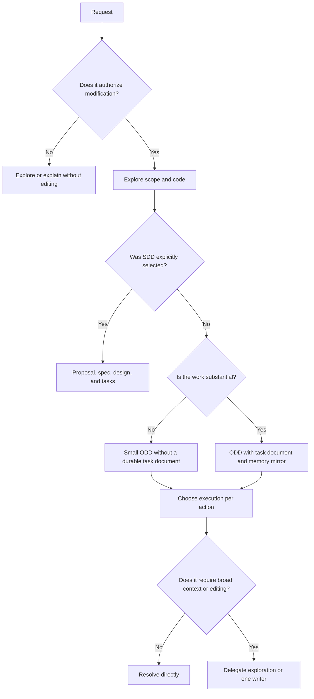
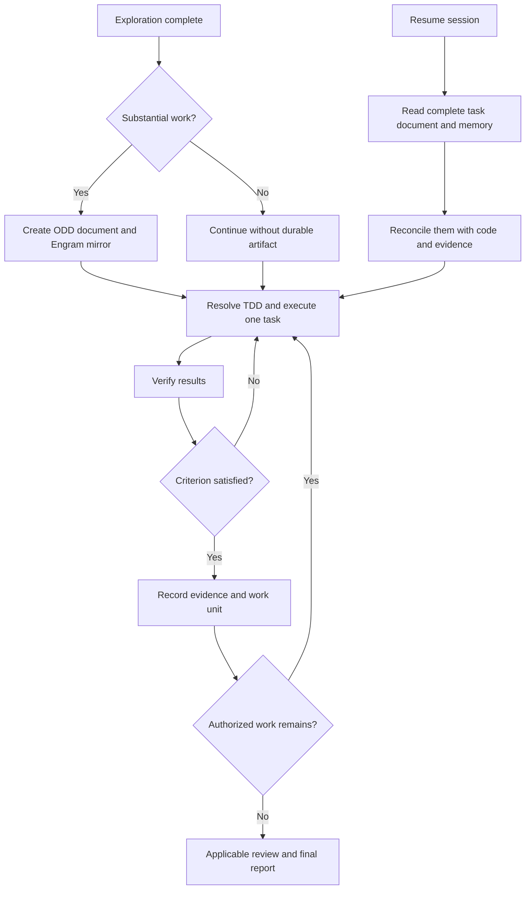
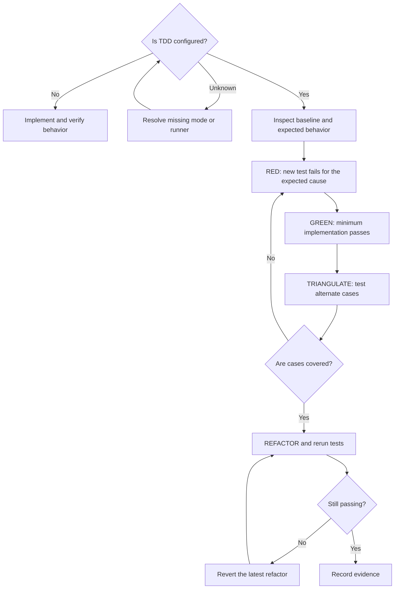
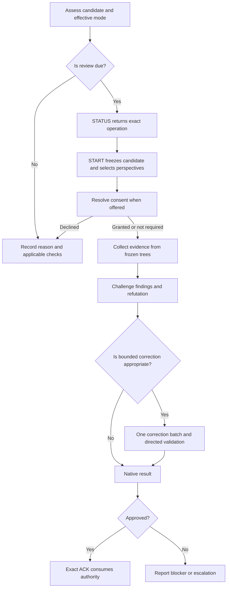
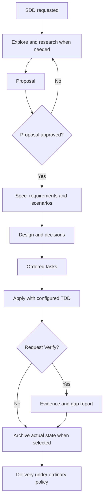

# How Gentle AI and Gentle Shell workflows fit together

This guide explains when ODD, TDD, RDD, and SDD apply, what evidence each workflow requires, and where the reviewed sources disagree.

**Reviewed:** September 20, 2026

**Scope:** downloaded `main` branches—not a user's installation and not certification of a stable release.

- gentle-ai: `f0782af2803a8192477c18d2186795e9c9daa6c3`
- gentle-shell: `54548321be8c8d60891e89ea13bf2b0ed10e1ac5`

The review compared documentation, orchestrator and worker instructions, risk-classifier and RDD implementations, and existing tests. Go tests and a real Pi session were not run in the original environment. The conclusions therefore describe what the reviewed sources specify and implement; they do not prove autonomous compliance with every step.

## 1. Responsibilities at a glance

| Component | Responsibility |
|---|---|
| Pi | Agent runtime: conversation, models, tools, and execution. |
| gentle-ai | Configures agents and projects skills and instructions. Its Go binary owns native SDD and RDD transitions. |
| gentle-shell | Pi work environment: orchestrator, workers, change views, profiles, and review transport. |
| gentle-pi | npm package name retained during the transition to gentle-shell. It is not a second methodology engine that must be chained. |
| Engram | Separate persistent memory. In ODD it retains a complete mirror of the feature task document when available. |

ODD organizes day-to-day work. TDD determines how behavior is built and demonstrated when enabled. RDD reviews one exact candidate against evidence bound to that candidate. SDD adds formal phase artifacts only when explicitly selected. TDD can operate inside ODD or SDD. SDD does not automatically start or consume RDD.

Sources: [Gentle Shell README](https://github.com/Gentleman-Programming/gentle-shell/blob/54548321be8c8d60891e89ea13bf2b0ed10e1ac5/README.md), [Gentle AI usage](https://github.com/Gentleman-Programming/gentle-ai/blob/f0782af2803a8192477c18d2186795e9c9daa6c3/docs/usage.md), and [native RDD contract](https://github.com/Gentleman-Programming/gentle-ai/blob/f0782af2803a8192477c18d2186795e9c9daa6c3/docs/review-integration.md).

## 2. Choose the workflow from the request



Three independent decisions matter:

| Decision | Signal | Consequence |
|---|---|---|
| Persist progress | Two or more meaningful steps, or progress worth recovering | Create `odd/tasks/<feature-name>.md` before source edits. |
| Delegate | Understand 4+ files; perform broad research; read in preparation for writing; modify 2+ non-trivial files | Use a bounded worker and retain one responsible writer. |
| Review more deeply | Risk evidence in the frozen candidate | RDD selects 0, 1, or 4 review perspectives. |

A parent can usually keep a read-only check of 1–3 files or one understood mechanical edit inline. These thresholds describe context per action, not a universal complexity score.

A large feature can remain entirely in ODD. A five-line authorization change can require deep review. Resolve uncertainty with research or one concrete question; uncertainty alone does not require SDD.

Sources: [routing rules](https://github.com/Gentleman-Programming/gentle-ai/blob/f0782af2803a8192477c18d2186795e9c9daa6c3/docs/trigger-rules.md) and [Pi delegation](https://github.com/Gentleman-Programming/gentle-shell/blob/54548321be8c8d60891e89ea13bf2b0ed10e1ac5/assets/orchestrator-delegation.md).

## 3. ODD phase by phase

ODD means **Organic Driven Development**. It is an adaptable working discipline, not another mandatory native state machine.

| Phase | Action | Evidence required to continue |
|---|---|---|
| Authorize | Distinguish explanation, investigation, and modification | Allowed scope; permission to investigate is not permission to edit. |
| Explore | Inspect relevant code, conventions, constraints, and tests | Enough understanding for the next change. |
| Resolve uncertainty | Research one named point or ask for a real decision | A decision or explicit assumption that permits progress. |
| Classify and track | Decide whether progress must be recoverable | For substantial work, an ODD task document and Engram mirror before the first source edit. |
| Implement | Execute the next authorized work unit; delegate when it saves context | TDD mode, source of that setting, and exact runner. |
| Verify | Run proportional checks | Observed results, not only a worker's claim. |
| Record and close | Update tasks, evidence, commit boundary, and next step | Pending and failed checks disclosed; review and delivery follow policy and authorization. |

The task document records goal, problem, motivation, scope, constraints, stable task identifiers, acceptance criteria, evidence, and next step. ODD does not manufacture proposal/spec/design artifacts for every change.



When accepted requirements change, update intent and affected tasks, preserve valid work, and explain what reopens. If Engram fails, keep local progress and report the mirror as pending. The two writes are not atomic. A finding does not authorize expanding the product automatically.

Delivery instructions group behavior, tests, and documentation into coherent work-unit commits with Conventional Commit messages. Repository policy and human delivery authorization still govern commit, push, PR, and release; RDD does not replace them.

Source: [complete ODD protocol](https://github.com/Gentleman-Programming/gentle-ai/blob/f0782af2803a8192477c18d2186795e9c9daa6c3/docs/usage.md).

## 4. TDD before implementation

TDD means **Test-Driven Development**. Under the reviewed ODD instructions, the mere presence of tests does not enable TDD. The parent resolves mode, source, and runner before delegation and resolves them again when work resumes.



| Stage | Useful evidence | Exit condition |
|---|---|---|
| Baseline | Relevant existing tests and known failures | New regressions are distinguishable from pre-existing failures. |
| RED | Test for missing behavior and observed failure | It fails for the expected cause before implementation. |
| GREEN | Exact command and passing result | Real implementation satisfies the case. |
| TRIANGULATE | Alternate, negative, or boundary cases | The solution does not satisfy only one example. |
| REFACTOR | Same tests after design improvement | Behavior remains green. |

Teaching example: a discount calculation first expects 90 from a price of 100 and a 10% discount. The minimum implementation passes. A second case expects 170 from 200 and 15%, and another validates invalid input. Design improves only after the behavior remains green. These values illustrate the workflow; they are not a Gentle rule.

For changes without executable behavior, such as passive documentation copy, the worker permits a precise exception while retaining applicable checks. TDD disabled means ordinary functional verification, not no verification.

**Verified discrepancy:** the ODD worker requires an observed RED failure, while `assets/support/strict-tdd.md` retains a clause that permits inferring failure when the function does not yet exist. `skills/gentle-ai/SKILL.md` also ties TDD to existing tests while the worker and orchestrator require configuration. The sources do not support claiming that every path applies one identical protocol.

Sources: [ODD worker](https://github.com/Gentleman-Programming/gentle-shell/blob/54548321be8c8d60891e89ea13bf2b0ed10e1ac5/assets/agents/gentle-ai-worker.md), [strict module](https://github.com/Gentleman-Programming/gentle-shell/blob/54548321be8c8d60891e89ea13bf2b0ed10e1ac5/assets/support/strict-tdd.md), and [conflicting general skill](https://github.com/Gentleman-Programming/gentle-shell/blob/54548321be8c8d60891e89ea13bf2b0ed10e1ac5/skills/gentle-ai/SKILL.md).

## 5. RDD: proportional depth over one exact candidate

RDD means **Receipt-Driven Development**. It freezes a change so every reviewer inspects the same version. Go code determines risk, perspectives, and transitions; the Pi host executes roles and returns candidate-bound results. The model must not invent the next transition or reconstruct opaque identifiers.

### Risk classification

| Published risk | Evidence | Perspectives when review starts |
|---|---|---|
| `passive` | Every frozen change is demonstrably passive by content and mode | 0: structural readback. |
| `medium` | Active change without a signal that elevates it | 1 selected perspective. |
| `high` | Sensitive signal or recognized critical path | 4: Risk, Resilience, Readability, and Reliability. |

Risk covers security and privilege. Resilience covers failure behavior. Readability covers clarity and maintainability. Reliability covers correctness and consistency. Each role prompt defines its exact scope.

Signals include authorization, security, payments, data exposure or loss, permissions, and process boundaries. The classifier combines paths, content, and modes. A `.md` extension alone does not prove passivity; agent-operation contracts can affect execution.

### When review becomes due in work-unit ODD

After a work-unit commit, the orchestrator can assess the range since the last reviewed boundary and read native `review_due`:

| Case | Result |
|---|---|
| Exact candidate already consumed | `already_reviewed`: do not repeat automatically. |
| High risk | `high_risk`: review is due. |
| Medium with at least 400 changed lines in the range | `slice_budget_reached`: review is due. |
| Medium below the range budget | `under_budget`: retain it in the pending range. |
| Passive | `passive`: structural checks can advance the boundary. |

This never bypasses delivery controls. A medium change under budget remains pending; it is not automatically reviewed.

The number 400 has three different uses: task-size guidance, a medium-risk review-range budget, and PR slicing strategy. It is not a risk elevation rule or permission to split behavior artificially. Delivery strategies include `ask-on-risk`, `auto-chain`, `single-pr`, and `exception-ok`; chains can be stacked to main or use a feature-branch tracker.

Sources: [0/1/4 classifier](https://github.com/Gentleman-Programming/gentle-ai/blob/f0782af2803a8192477c18d2186795e9c9daa6c3/internal/reviewtransaction/risk.go), [`review_due` calculation](https://github.com/Gentleman-Programming/gentle-ai/blob/f0782af2803a8192477c18d2186795e9c9daa6c3/internal/cli/review_assess.go), and [ODD usage](https://github.com/Gentleman-Programming/gentle-ai/blob/f0782af2803a8192477c18d2186795e9c9daa6c3/docs/usage.md).

### Review transaction



Transaction boundaries:

1. **Assessment and STATUS** are not approval; they return the permitted next operation.
2. **START** binds repository, candidate, review, and lineage and selects perspectives.
3. **Consent** is provider-owned. Declining one candidate does not disable RDD globally.
4. **Reviewers** inspect immutable trees and return structured evidence.
5. **Refutation** challenges allegations so suspicion is not accepted as fact.
6. **Correction** permits at most one bounded batch in the transaction—not an endless fix/review loop.
7. **Directed validation** checks original criteria and correction regressions. Inability to inspect is neither approval nor proof of a defect.
8. **Closure** consumes approved authority through exact ACK. It cannot authorize another candidate.

The outcome is informational for delivery. It does not commit, push, merge, or release, and approval does not prove universal absence of defects.

Source: [review integration contract](https://github.com/Gentleman-Programming/gentle-ai/blob/f0782af2803a8192477c18d2186795e9c9daa6c3/docs/review-integration.md).

### When RDD does not run

Gentle Shell documents an alternate path for delegated work:

| Condition | Verification |
|---|---|
| RDD closed for that candidate | Writer checks plus native review as independent evidence. |
| RDD off, unknown, declined, or unavailable; passive change | Parent structural readback. |
| Same condition; medium risk | Writer evidence; an additional verifier when the writer profile is mini or low effort. |
| Same condition; high risk | Writer plus independent verifier. |
| Assessment fails or risk is unknown | Treat as high for this verification decision. |

The parent retains a focused check. Passive exceptions use structural inspection rather than invented test commands. Declining RDD never lowers the standard below the RDD-off route.

Source: [delegated verification](https://github.com/Gentleman-Programming/gentle-shell/blob/54548321be8c8d60891e89ea13bf2b0ed10e1ac5/docs/delegated-verification.md).

## 6. SDD: the formal alternative

Choose SDD when separate approvable artifacts and formal phase coordination are desired. It is not a mandatory higher complexity tier.



Verify is optional and may evaluate partial work. Archive records truth and history, including incomplete work when explicitly requested; it does not require a verification certificate or turn pending work into completed work. SDD does not launch RDD or consume RDD results as an archive gate.

Source: [intended usage and SDD cycle](https://github.com/Gentleman-Programming/gentle-ai/blob/f0782af2803a8192477c18d2186795e9c9daa6c3/docs/intended-usage.md).

## 7. Practical examples

| Illustrative request | Expected route | Evidence to demonstrate |
|---|---|---|
| Correct help text | Small ODD; direct edit if already understood | Correct copy; structural readback when content is truly passive. |
| Fix a service calculation | ODD; direct or delegated according to context | Bug case and regressions; TDD when configured. |
| Add CSV export respecting filters | Substantial ODD with task document, bounded exploration, and writer | Filters, escaping, empty output, relevant errors, and review according to the real candidate. |
| Change access permissions | Potentially few lines but high risk | Allowed and denied cases, security evidence, and deep review. |
| Redesign authentication with approvable artifacts | SDD only when selected | Proposal, spec, design, tasks, and implementation evidence. |

These examples apply the reviewed rules; they are not results from executing these projects in Pi.

## 8. Verified discrepancies

| Topic | Observed difference | Interpretation |
|---|---|---|
| Default RDD mode | README says opt-in/off; reviewed `main` code, tests, and trigger rules say on without preferences | Use code to describe that reviewed revision and inspect the effective installed mode. |
| TDD activation | General skill says existing tests enable it; worker and orchestrator require configuration | Do not claim uniformity; the documented ODD route preserves explicit resolution. |
| RED evidence | Worker requires observed failure; strict module permits inference when the function is absent | This is a concrete upstream inconsistency. |
| Review timing | General contract discusses a final candidate; newer ODD guide details commits and accumulated ranges | Apply scoped instructions and retain `next_transition`; do not reconstruct one universal flow from prose. |
| Pi parity | Gentle AI and Gentle Shell ship prompts separately | Updating one does not prove the other adopted or executed the same rules. |

Read-only inspection commands for a real installation:

```bash
gentle-ai review mode status --cwd <repo> --json
gentle-ai review assess --cwd <repo> --json
```

The second command classifies the current candidate. It does not start review or approve delivery. Commit ranges require a real base and `--committed-only`.

Sources: [README](https://github.com/Gentleman-Programming/gentle-ai/blob/f0782af2803a8192477c18d2186795e9c9daa6c3/README.md), [mode implementation](https://github.com/Gentleman-Programming/gentle-ai/blob/f0782af2803a8192477c18d2186795e9c9daa6c3/internal/cli/review_mode.go), and [default-on tests](https://github.com/Gentleman-Programming/gentle-ai/blob/f0782af2803a8192477c18d2186795e9c9daa6c3/internal/reviewtransaction/rdd_mode_test.go).

## 9. Technical assessment

The separation of responsibilities is coherent: ODD limits ceremony for daily work, TDD can strengthen construction, and RDD adds proportional independent evidence. Recovery through a task document and memory supports long work without turning every task into SDD.

The main weakness is drift among instructions, documentation, and code. Adoption should pin compatible versions, establish one source of truth for configuration and risk, and exercise real journeys: small passive work, medium work with and without TDD, high risk, review decline, memory failure, and resumption. This is an assessment of reviewed evidence, not a certified product capability.

## 10. Delivered diagrams and visual limits

The repository includes standalone ODD, RDD, and SDD HTML diagrams plus the Mermaid diagrams in this guide. The standalone views are summaries; the tables and Mermaid diagrams document alternate conditions and paths.

The three delivered HTML diagrams passed all nine deterministic Archify checks with no composition errors or warnings. Browser inspection was not run in the original environment because Chrome/Chromium was unavailable, so no visual-browser claim is made. The TDD HTML candidate did not meet the legibility threshold and is not delivered; its complete flow remains in Mermaid above. Viewer controls and this guide are English. Archived rendered simulator assets may still contain Spanish on-screen copy and are labeled accordingly.
